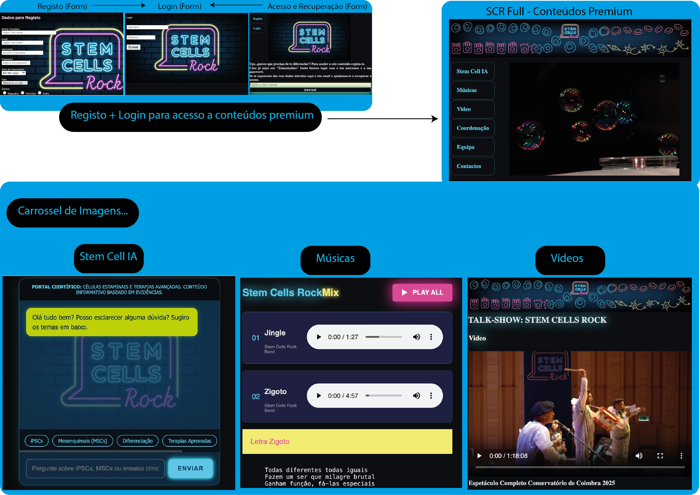

# Talk-show: Stem Cells Rock

> Este website resume a atividade do projeto de comunicação de ciência "Talk-show: Stem Cells Rock", um espetáculo de teatro-musical acerca de células estaminais.

## 💻 Sobre o projeto
Neste website há informação geral "scrOPEN.html" com imagens, um vídeo (teaser) com um resumo do espetáculo, detalhes sobre a equipa, coordenação e contactos. Na versão "scrFULL.html" os utilizadores podem aceder após "registo.html" e "login.html", a conteúdos premium que incluem mais imagens, vídeos (shows completos), "Playlist.html" com músicas e letras de canções e ChatBot de IA científico (responde às perguntas dos utilizadores baseado em evidências científicas). O website tem como ponto de entrada uma coverpage com o logotipo do projeto. O website tem pontos que direcionam o utilizador para sites de referência acerca da temática das células estaminais e para mais informações acerca do coordenador do projeto.

## 📦 Como navegar no projeto
O projeto está em repositório no github. O ponto de entrada é a [COVERPAGE](/index.html). O SABER MAIS dá acesso à [versão SCR OPEN](/SCRprincipal/scrOPEN.html). Dentro da versão open o utilizador tem uma barra de navegação à esquerda com botões de: Registo; Login; Stem Cell IA; Músicas; Vídeo; Coordenação; Equipa e Contactos. Os botões Stem Cell IA e Músicas acionam uma página de [AcessoRestrito](/SCRprincipal/AcessoRestrito.html) em que se sugere o registo ou o login e se oferece a possibilidade de recuperação de dados de acesso. Os outros botões de navegação dão acesso a conteúdos abertos dentro da página SCR OPEN. Há um vídeo teaser do show numa secção mais abaixo na página onde há outro botão para aceder a MAIS VÍDEOS que se for clicado volta a direcionar para acesso restrito.

Fazendo registo e login o utilizador tem acesso à [versão SCR FULL](../SCRprincipal/scrFULL.html). Nesta versão premium a página tem um pequeno carrossel de imagens e o utilizador tem acesso a uma playlist onde pode ouvir as músicas do show enquanto vê as letras das canções num collapsible [Playlist](../Playlist/playlist.html) em modo playall de forma aleatória ou sequencial, ou pode escolher manualmente que músicas quer ouvir. Para além das músicas o utilizador pode ver vídeos completos de 2 apresentações diferentes que são carregadas a partir de repositório unlisted do Youtube [Vídeos](../SCRprincipal/videos.html). A versão full inclui também um [Stem Cell IA](../SCRprincipal/scrSciBot.html) que é um science chatbot baseado em evidências científicas que constitui uma janela de interação com inteligência artificial dentro do website onde pode fazer perguntas científicas acerca dos conteúdos abordados no talk-show.

 

## 🛠 Funcionalidades no Futuro
- [Registo] criação de database de utilizadores registados (Registo de utilizadores). Email de contacto poderá ser usado para informar da agenda de espetáculos e para contactos de merchandising como venda de t-shirts, etc...
- [Loja Online] Loja Online (Integração com API de loja Online)
- na versão full está previsto integrar uma pequena secção de comentários vindos da página Facebook já criada; Talk-show: Stem Cells Rock [https://www.facebook.com/profile.php?id=61588815366051]

---
Feito por [Ricardo Neves] - [https://linktr.ee/ricardoneves_scitenor]
[https://www.linkedin.com/in/ricardo-pires-das-neves/]
[https://www.instagram.com/ricardoneves_scitenor/]
