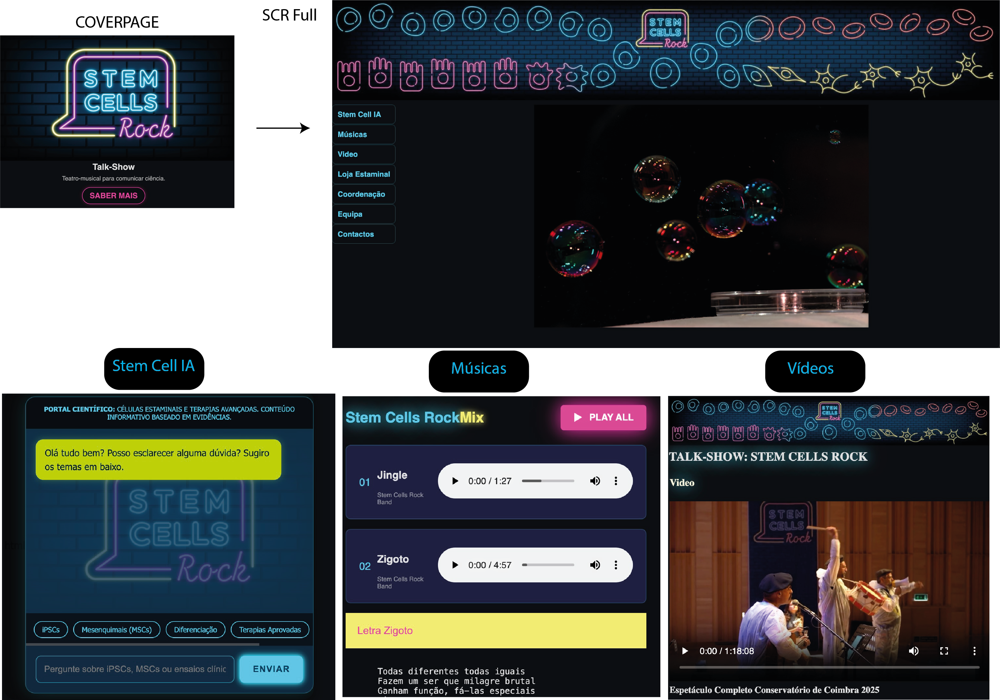
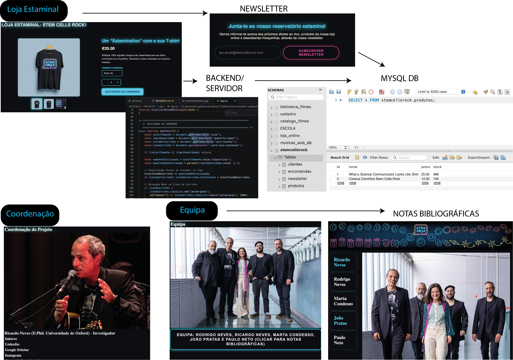
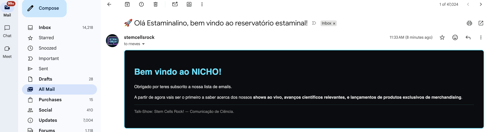
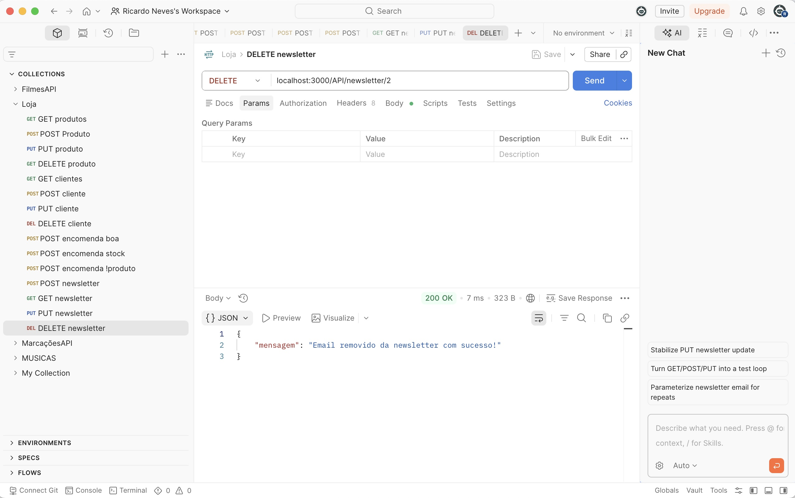

# Talk-show: Stem Cells Rock

> Este website resume a atividade do projeto de comunicação de ciência "Talk-show: Stem Cells Rock", um espetáculo de teatro-musical acerca de células estaminais.


## 💻 Sobre o projeto
O website tem como ponto de entrada uma coverpage com o logotipo do projeto. O website tem pontos que direcionam o utilizador para sites de referência acerca da temática das células estaminais e para mais informações acerca do coordenador do projeto. Neste website há um carrossel de imagens, um vídeo (teaser) com um resumo do espetáculo, detalhes sobre a equipa, coordenação e contactos. Os utilizadores podem aceder a mais conteúdos que incluem mais imagens, vídeos (shows completos), uma "Playlist.html" com músicas e letras de canções e ChatBot de IA científico (responde às perguntas dos utilizadores baseado em evidências científicas). Na barra de navegação há um botão que direcciona o utilizador para uma loja online onde pode comprar produtos de merchandising e aderir à newsletter. Esta página está ligada a um servidor no backend e a base de dados MySQL.

## 📦 Como navegar no projeto
O projeto está em repositório no github. O ponto de entrada é a [COVERPAGE](../index.html). O SABER MAIS dá acesso à página principal [scrFULL](../SCRprincipal/scrFULL.html).



A página tem um pequeno carrossel de imagens e o utilizador tem acesso a uma playlist onde pode ouvir as músicas do show enquanto vê as letras das canções num collapsible [Playlist](../Playlist/playlist.html) em modo playall de forma aleatória ou sequencial, ou pode escolher manualmente que músicas quer ouvir. Para além das músicas o utilizador pode ver vídeos completos de 2 apresentações diferentes que são carregadas a partir de repositório unlisted do Youtube. [Vídeos](../SCRprincipal/videos.html)

A página inclui também um [Stem Cell IA](../SCRprincipal/scrSciBot.html) que é um science chatbot baseado em evidências científicas, que constitui uma janela de interação com inteligência artificial dentro do website, onde pode fazer perguntas científicas acerca dos conteúdos abordados no talk-show.

* **Futuras atualizações:** Está previsto integrar uma pequena secção de comentários vindos da página Facebook já criada: [Talk-show: Stem Cells Rock](https://facebook.com).

Na barra de navegação tem um botão que direciona para a [Loja Estaminal](../Loja/loja.html) onde está a ligação ao backend e BDs.



## 🛠 Outras funcionalidades
* **Loja Online:** Futura integração com API de loja Online ligada a servidor e base de dados com `server.js`, `app.js` e `mysql2`.
* **Newsletter:** A Loja Online sugere ao utilizador a subscrição de Newsletter com criação de database de email de contacto que poderá ser usado para informar da agenda de espetáculos e para contactos de merchandising como venda de t-shirts, etc...

---

# 🚀 Stem Cells Rock! — Backend API (Loja Online & Newsletter)

Este projeto inclui o desenvolvimento do servidor backend para a plataforma **Stem Cells Rock!**, um projeto focado na comunicação de ciência. A API foi desenvolvida em Node.js com Express e interage com uma base de dados relacional MySQL (InnoDB), incluindo validações completas de segurança, gestão de stock de inventário e envio automatizado de emails através do Nodemailer (Gmail SMTP).


O projeto tem um ficheiro **listar.js** que constitui uma ponte entre a base de dados e o interface do utilizador (mimetiza o backoffice), que permite criar listas ou tabelas estruturadas com base na informação atualizada das encomendas, produtos ou subscrição da newsletter.

---

## 🛠️ Tecnologias Utilizadas

* **Node.js** — Ambiente de execução JavaScript para o servidor.
* **Express.js** — Framework web para criação avassaladora de rotas e middlewares.
* **MySQL (mysql2/promise)** — Base de dados relacional com suporte a operações assíncronas.
* **Nodemailer** — Biblioteca para disparo de emails via SMTP (Gmail App Passwords).
* **Dotenv** — Gestão segura de credenciais e variáveis de ambiente.
* **CORS** — Middleware para permitir a comunicação segura com o frontend.


---

## 📦 Estrutura e Integridade da Base de Dados (MySQL)

O sistema utiliza o motor **InnoDB** para garantir a integridade referencial através de chaves estrangeiras (`Foreign Keys`) com restrições `ON DELETE RESTRICT`. Isto impede falhas catastróficas, como a eliminação de um produto ou cliente que possua encomendas ativas.

### Tabelas Criadas Automaticamente:
1. `produtos` — Catálogo de merchandising (com povoamento automático inicial).
2. `clientes` — Registo e controlo de utilizadores únicos por e-mail.
3. `encomendas` — Registo de compras efetuadas com morada detalhada de envio.
4. `newsletter` — Lista de subscritores para ações de e-mail marketing.

---

## 🔐 Configuração do Ambiente (`.env`)

Crie um ficheiro `.env` na raiz do projeto com as seguintes variáveis (substitua pelos seus dados reais):

```env
PORT=3000

DATABASE_HOST=localhost
DATABASE_PORT=3306
DATABASE_USER=root
DATABASE_PASSWORD=a_sua_senha
DATABASE_NAME=stemcellsrock

GMAIL_USER=o_seu_email@gmail.com
GMAIL_APP_PASS=as_suas_16_letras_da_app_password
```

---

## 🚀 Como Executar o Projeto

1. Garanta que o serviço do **MySQL** está ativo no seu computador.
2. Crie a base de dados vazia chamada `stemcellsrock` (ou o nome que definiu no `.env`).
3. Instale as dependências do projeto:
   ```bash
   npm install
   ```
4. Inicie o servidor:
   ```bash
   node server.js
   ```
5. O console exibirá a confirmação de leitura do ambiente e a criação/validação automática das tabelas.

---

## 🛣️ Documentação das Rotas da API (Endpoints)

A API segue o padrão arquitetural REST, disponibilizando operações CRUD completas para os principais recursos do sistema. Embora o fluxo atual da loja não precise de algumas destas rotas diretamente, existem cenários reais no comércio eletrónico onde estas rotas são obrigatórias. Imaginando que futuramente vai ser preciso construir um Painel de Administrador (Backoffice) para gerir a loja será preciso ter controlo sobre o catálogo de produtos ou sobre a lista de clientes.

### 👕 Recurso: Produtos (`/api/produtos`)
* `GET /api/produtos` — Lista todos os produtos disponíveis no catálogo.
* `POST /api/produtos` — Adiciona um novo produto ao inventário (Requisito CRUD).
* `PUT /api/produtos/:id` — Atualiza os dados de um produto específico (Requisito CRUD).
* `DELETE /api/produtos/:id` — Remove um produto (Bloqueado se existirem encomendas associadas).

### 👥 Recurso: Clientes (`/api/clientes`)
* `GET /api/clientes` — Lista todos os clientes registados (Requisito CRUD).
* `POST /api/clientes` — Regista um novo cliente ou reutiliza um existente caso o email já exista.
* `PUT /api/clientes/:id` — Atualiza as informações de perfil do cliente (Requisito CRUD).
* `DELETE /api/clientes/:id` — Remove um cliente (Bloqueado se possuir histórico de compras).

### 📧 Recurso: Newsletter (`/api/newsletter`)
* `GET /api/newsletter` — Lista todos os emails subscritos na mailing list (Requisito CRUD).
* `POST /api/newsletter` — Insere um novo email na lista e dispara um e-mail automático de boas-vindas.
* `PUT /api/newsletter/:id` — Permite editar ou corrigir o endereço de e-mail de um subscritor (Requisito CRUD).
* `DELETE /api/newsletter/:id` — Remove o e-mail da lista (Fluxo de *Unsubscribe* - Requisito CRUD).

### 🛒 Recurso: Encomendas (`/api/encomendas`)
* `POST /api/encomendas` — Processa o checkout do carrinho de compras.
  * *Lógica de Negócio:* Valida se o produto existe, verifica se há stock suficiente no inventário, abate a quantidade comprada na tabela `produtos` e regista o pedido com os dados de entrega.

---

## 🧪 Testes da API
Todas as rotas foram extensamente validadas utilizando o **Postman**, cobrindo cenários de sucesso e respostas controladas de erro (como HTTP 400 para stock insuficiente ou duplicações e HTTP 404 para recursos inexistentes).



---
Feito por [Ricardo Neves](https://github.com) | [Linktree](https://linktr.ee) | [LinkedIn](https://linkedin.com) | [Instagram](https://instagram.com)


